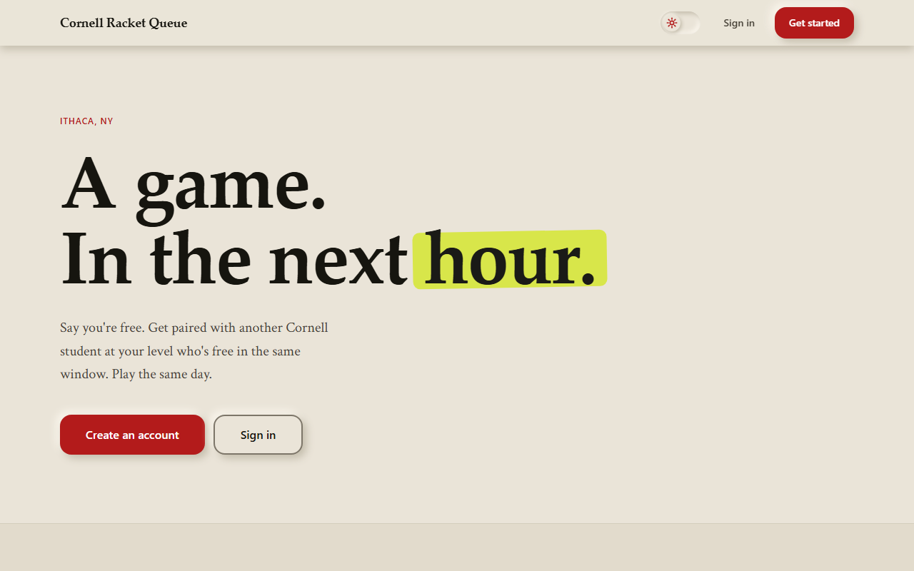
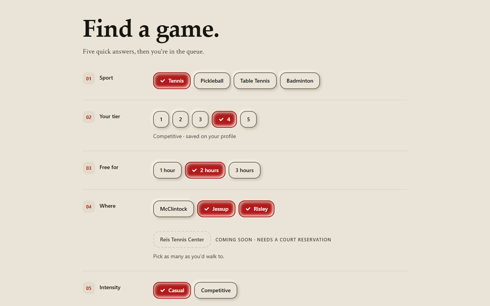
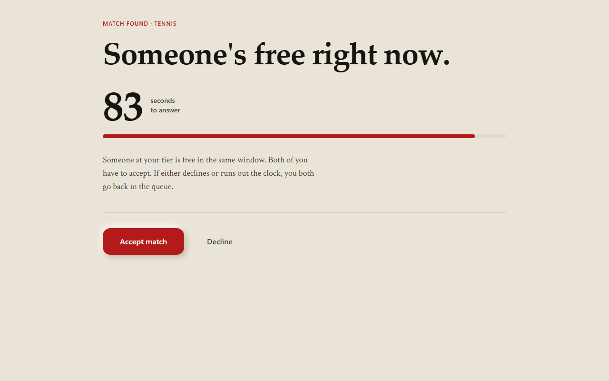
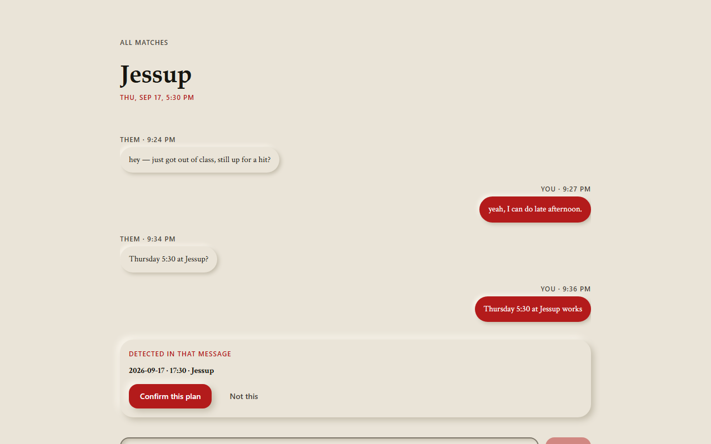

# Cornell Racket Queue

**Say you're free. Get matched with another Cornell student at your level who's
free in the same window. Play the same day.**

Pickup racket sports on campus fail on coordination, not interest. Group chats
are full of "anyone free later?" that never resolves, because saying yes costs
something and nobody wants to be first. This turns that into a queue: you
declare a window, the system finds someone compatible, and both sides commit
inside ninety seconds or it's off.

[**Live**](https://cornell-paddle-match.vercel.app) ·
[Demo video](docs/media/demo.mp4) ·
[Schema contract](docs/schema-contract.md)


---

<p align="center">
  
  
</p>
<p align="center">
  
  
</p>

## How it works

1. **Ready up.** Sport, skill tier, how long you're free, which courts you'd
   walk to, casual or competitive.
2. **Get matched.** The queue looks for someone in the same sport and intensity,
   within one tier, with an overlapping time window and at least one shared
   court.
3. **Both accept, within 90 seconds.** If either declines or the clock runs out,
   both go back in the queue. A match that needs chasing isn't a match.
4. **Sort out the details in chat**, and confirm a time and court onto the
   match.

## The two LLM integrations

Both use **forced tool use** — the model is required to call a named tool with a
typed schema, never to emit free-form text that gets parsed afterwards. Both
also assume the model can be wrong, and are built so that being wrong is
survivable.

### Skill-tier normalisation

People describe how they play in prose: *"played JV in high school, still hit a
few times a month."* Matching needs a 1–5 tier. The model returns
`{tier, confidence, rationale}` against a strict schema.

The design decision worth pointing at is the **confidence floor**. Below 0.6,
nothing is written — the UI shows a manual tier picker instead of silently
recording a guess. A wrong tier doesn't produce a wrong string on a screen; it
produces a real person driving across campus to play someone two levels off.
The rationale is surfaced so the suggestion can be argued with.

`lib/anthropic/skill-normalizer.ts` · `app/api/onboarding/skill-normalize/route.ts`

### Scheduling extraction

In a confirmed match's chat, *"Thursday 5:30 at Jessup?"* should become a
confirmable plan. The model extracts `{hasProposal, date, time, court,
confidence}`.

Three things guard it:

- **A keyword pre-filter runs first.** Most chat messages aren't proposals, so
  they never reach the model at all. This is a cost and latency decision, not a
  correctness one.
- **`court` is constrained to an enum of real Cornell courts in the JSON schema,
  and re-validated in TypeScript afterwards.** The schema constraint is the
  first line of defence, not the only one — structural adherence is never fully
  trusted, and a confirmed match must never come to rest at an invented
  location.
- **Extraction never writes.** It produces a suggestion; a human tap calls
  `PATCH /api/matches/[matchId]/schedule`, which re-validates the court again at
  the route boundary, because that request arrives from a browser and could
  carry anything.

The message body is arbitrary user-authored text, so it's held in a delimited
block within the user turn — nothing inside it can change the instructions, the
court list, or which tool gets called.

If either call fails, the feature degrades instead of breaking: the message is
already sent before extraction runs, so an API error is a lost enhancement, not
a failed send.

`lib/anthropic/schedule-extractor.ts` · `lib/anthropic/schedule-prefilter.ts`

## Tech stack

| Layer | Choice | Why |
|---|---|---|
| Framework | Next.js 16, App Router | Server Components for data-dependent screens; one deploy target for UI and API |
| Language | TypeScript (strict) | — |
| Database | Supabase Postgres | Row Level Security as the actual authorisation boundary, not an app-layer check |
| Auth | Supabase Auth | `@cornell.edu`-only, enforced by a database trigger on `auth.users` |
| Realtime | Supabase Realtime | Match arrival and chat messages arrive as Postgres change events; no polling |
| LLM | Anthropic API | Forced tool use for both integrations |
| Styling | Tailwind CSS v4 | Tokens declared in CSS, no config file |
| UI primitives | Base UI, CVA, sonner | Accessible Select/Field behaviour without adopting a whole design system |
| Tests | Vitest | 64 tests |
| CI/CD | GitHub Actions, Vercel | typecheck + tests + build on every push |

Roughly 6,900 lines across 87 source files.

## Architecture

### The interesting problem: two people claiming the same partner

Matching is a race. Two students readying up at the same moment can both see the
same waiting entry as their best candidate, and a naive read-then-write hands
that person to both of them.

The whole claim runs as one PL/pgSQL function inside a single transaction:

```sql
select qe.id into v_candidate_id
from public.queue_entries qe
where qe.status = 'waiting'
  and ...
order by abs(qe.skill_tier - p_skill_tier) asc, qe.created_at asc
for update skip locked
limit 1;
```

`FOR UPDATE SKIP LOCKED` means two concurrent ready-ups can't even attempt to
lock the same row — one simply sees it as unavailable and moves on. The
`WHERE status = 'waiting'` guard on the subsequent `UPDATE` stays as a second,
independent check. This is a stronger guarantee than sequential guarded updates
from application code, where the inserted row isn't visible to other
transactions until commit.

### Expiry without a scheduler

Proposals expire after ~90 seconds. The obvious implementation is a cron job,
and the first version used one — which broke on Vercel's Hobby plan, where
sub-daily crons don't run. The failure wasn't cosmetic: abandoned proposals left
both queue entries stuck at `matched`, invisible to every future match, so the
candidate pool shrank with each one.

`ready_up()` now sweeps expired proposals opportunistically before looking for a
candidate. The system heals under exactly the traffic that needs it healed, with
no scheduler, no external service, and no paid plan. The cron endpoint survives
as a daily janitor, but correctness no longer depends on it.

### Authorisation

Every table has RLS. Reads are scoped to the rows you participate in — you can't
read another user's queue entry before a match links you, and you can't read
messages from a match you're not in.

The operations that legitimately cross users (claiming someone else's queue
entry) can't be expressed that way, so they're `SECURITY DEFINER` functions,
each explicitly revoked from `anon` and `authenticated` and callable only by the
service role. Route handlers establish caller identity from the access token —
never from a body-supplied user id — and pass it in as an argument.

### Accessibility

WCAG 2.1 AA is the target. Contrast was measured in-browser rather than
estimated, including the non-text 3:1 requirement for interactive boundaries
(1.4.11), which matters more than usual because the interface is neumorphic and
a shadow has no contrast ratio. State is never carried by colour alone. Known
gaps are listed honestly on [/accessibility](https://cornell-paddle-match.vercel.app/accessibility)
rather than claiming conformance.

## Testing

```bash
npm run typecheck    # tsc --noEmit
npm test             # vitest — 64 tests
npm run build        # production build
```

All three run on every push and pull request
([ci.yml](.github/workflows/ci.yml)).

Unit tests cover the matching logic, both LLM integrations including their
low-confidence fallback paths, schedule parsing and DST boundary handling, and
the deployment's security headers. There is also a **pgTAP concurrency test**
that fires two simultaneous ready-ups at one candidate and asserts exactly one
wins — it requires a running Postgres and is skipped when one isn't configured.

## Running it

```bash
npm install
cp .env.example .env.local   # Supabase + Anthropic credentials
npm run dev
```

Deploying a fresh instance is scripted end to end:

```bash
bash scripts/go-live.sh
```

It sets the six environment variables, applies migrations, redeploys, and polls
`/api/health` until the deployment reports itself configured, reachable and
migrated. [`scripts/schema.sql`](scripts/schema.sql) is the same five migrations
concatenated for pasting into the Supabase SQL Editor if you'd rather skip the
CLI.

## Status

The application is built, tested and deployed. **It is not yet connected to a
live database** — the Supabase project is being provisioned, so signed-in
features return errors until the six environment variables hold real values. The
public pages work.

```bash
curl -s https://cornell-paddle-match.vercel.app/api/health
```

That endpoint distinguishes a variable that is *set* from one set to a
placeholder, and a database that is *reachable* from one that has actually been
migrated — a distinction that cost a day when a fully-placeholder deployment
looked healthy.

### Known gaps

- **No Content-Security-Policy.** The App Router emits inline hydration scripts,
  so a CSP worth having needs per-request nonce plumbing, and a wrong
  `connect-src` silently stops Realtime from reconnecting. Left out rather than
  shipped as something that only looks like protection; the other five security
  headers are set and verified.
- **The legal pages have had no legal review.** They describe the app's real
  data flows accurately, which isn't the same as a lawyer signing off.
- The pgTAP concurrency suite has never run in CI, since it needs a live
  Postgres.

## Repository map

```
app/
  (app)/          play, profile, matches — everything behind sign-in
  (auth)/         sign-in, sign-up
  (legal)/        privacy, terms, accessibility
  api/            route handlers (queue, matching, LLM, cron, health)
components/ui/    Button, Card, Select, TextInput, Textarea, Skeleton…
lib/
  anthropic/      the two LLM integrations + the schedule pre-filter
  matching/       queue and response logic
  supabase/       browser / server / service-role clients
  courts.ts       researched Cornell venue data
supabase/
  migrations/     schema, RLS policies, matching functions, realtime
  tests/          pgTAP
docs/             schema contract, build notes, media
scripts/          go-live.sh, schema.sql
```

### A note on `lib/courts.ts`

Venue data is researched rather than invented: which courts host which sport,
which are open-rec, which are residents-only, and which need a reservation.
Cornell's dorm game rooms (Bethe, Becker, Mews, Hu Shih) are marked
residents-only because they are, and Reis Tennis Center is marked as needing a
reservation rather than being offered as a queueable option. Sources are cited
in the file header.

---

Built by [Yosef Mimarbasi](https://github.com/YosefMimarbasi). Not affiliated
with or endorsed by Cornell University.
